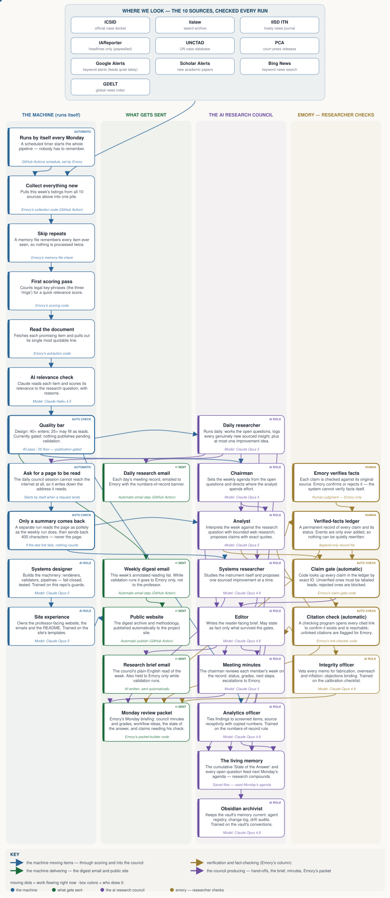

# ISDS Thematic Watcher

A transparent, automated lead-generation and annotated-bibliography tool for one narrow
investor–State dispute settlement (ISDS) research question. It is a weekly, zero-cost
instrument — not a validated doctrinal monitor or a comprehensive census of ISDS activity.

It watches for cases where intellectual property is asserted as a protected investment, where
the disputed conduct is a regulatory or judicial measure, and where threshold questions of
jurisdiction and admissibility may be in play. Built as a research instrument for the
Benavides ISDS project, it runs entirely on GitHub Actions and produces two weekly emails: an
annotated-bibliography digest of what surfaced, and an interpretive research brief that reads
those developments against the project's research question. Its results are leads to be
verified before they are relied upon, not adjudications.

**Website:** https://jackemorywilliams-bit.github.io/isds-watcher/
**Methodology:** [METHODOLOGY.md](METHODOLOGY.md) · **Digest archive:** [digests/](digests/)

## What it watches

The theme was derived from three seed awards — *Philip Morris v. Australia*, *Eli Lilly v.
Canada*, and *Bridgestone v. Panama* — and expressed as the overlap of three doctrinal
"rings":

1. **IP as a protected investment** — patents, trademarks and licences, copyrights,
   geographical indications, data exclusivity, and brand value treated as a covered
   investment.
2. **A regulatory or judicial measure as the disputed conduct** — public-interest
   legislation, a domestic court judgment, or judicial conduct itself. This ring is
   weighted: a credible challenge to a court judgment reaches at least the MEDIUM band on
   its own.
3. **A jurisdictional or admissibility doctrine** — abuse of right, treaty shopping,
   foreseeability of the dispute, restructuring for treaty protection, or the contested
   definition of "investor."

A development scores HIGH (≥70) when two rings intersect, MEDIUM (40–69) when one strong
ring carries a weaker second tie or a judicial-measure case stands alone, and LOW (<40)
otherwise.

## How it works

Each run fetches new items from the sources, deduplicates them against prior runs,
pre-scores them against a keyword fingerprint, and enriches the most promising candidates
by retrieving their source pages. A language model (Claude or Gemini) then classifies the
enriched items under a few-shot prompt and returns a relevance score, the rings matched,
and a short annotation. Items at or above the threshold are written into a dated archive
folder and an annotated-bibliography email, and the website is rebuilt. Each stage is
defensive: a failing source or item is logged and skipped rather than allowed to stop the
run. With no API key the classifier falls back to the deterministic keyword scorer, so a
dry run works entirely offline. The full method, with its scholarly grounding, is in
[METHODOLOGY.md](METHODOLOGY.md).

The entire system on one chart — the nine sources, the automated pipeline, the AI
research council (with each agent's model), the researcher's human-verification
column, and every Monday deliverable, with animated dots showing work flowing
through it (drawn deterministically from this repository; every box cites the file
that implements it):



An annotated, hoverable version lives on the project site:
[How It Works](https://jackemorywilliams-bit.github.io/isds-watcher/how-it-works.html).

## The weekly digest

Every Monday, an annotated-bibliography digest goes to the configured recipient. Each
surfaced development appears as a citation, a two-sentence descriptive-and-evaluative
annotation, a quoted notable line from the source, and the rings it matched. The same
content is committed to the repository under `digests/YYYY-MM-DD_ISDS-Thematic-Watch/`,
with one Markdown file per entry, and is published to the website.

The digest reports every match at or above the threshold with no upper cap, so a busy week
shows all of them. To keep a normal week substantive it fills up to a minimum of six items
with the closest near-misses, but only those at or above a relevance floor of 25
(`MIN_DIGEST_ITEMS=6`, `RELEVANCE_FLOOR=25` in `src/config.py`). Honesty is preferred over
padding: a genuinely quiet week may carry only 0–3 items, and a week with nothing above 25
sends a one-sentence note ("no thematically relevant developments this week — N candidates
screened") rather than weak filler. The very first run indexes all existing items as a
baseline and sends only a baseline note, so every subsequent digest contains only genuinely
new developments.

## The research council and the weekly brief

The digest reports *what* surfaced; a second weekly email — the **ISDS Research Brief** —
interprets it. The brief is produced by what the project calls its research council: not a
set of standing background agents, but a set of clearly-defined roles realized as coordinated
stages of the same weekly run. A chairman sets the agenda from this week's items and the open
threads carried forward from prior weeks; a research analyst interprets the developments
against the research question and escalates to web search for supplemental findings; a
deterministic integrity gate checks every claim the analyst proposes against the operator's
append-only verification ledger; and an editor turns the vetted memo into the structured brief.
Brief findings are now gated on operator verification: only claims the operator has marked
verified (`python scripts/verify.py mark`) may be asserted — everything else is presented as
an unverified lead or routed for library access, never as an established finding.
Each role is a prompt or pipeline component, and every role's output is archived, so the work
stays auditable and reproducible while gaining the multi-perspective rigor of a council. The
open threads from each issue are persisted and fed back into the next week's agenda, so the
research compounds rather than restarting cold. The full account of the roles is in
[COUNCIL.md](COUNCIL.md); brief issues are archived under [briefs/](briefs/).

The brief requires the Anthropic provider and key (its web search is an Anthropic server
tool). When that is unavailable, or on a dry run, or on any error, the brief is simply skipped
and the digest is unaffected.

## Configuration

Runtime configuration comes from the environment — locally through a `.env` file, and in
CI through GitHub Secrets and Variables.

| Name | Where | Purpose |
|------|-------|---------|
| `MODEL_PROVIDER` | Actions variable | `claude` (default) or `gemini` |
| `ANTHROPIC_API_KEY` / `GEMINI_API_KEY` | Secret | classifier key, matched to the provider |
| `SMTP_HOST` · `SMTP_PORT` | Secret | `smtp.gmail.com` · `465` |
| `SMTP_USER` · `SMTP_PASS` | Secret | sending Gmail address and 16-character App Password |

Recipients are set in `src/config.py`. Model overrides: `GEMINI_MODEL` (default
`gemini-2.0-flash`), `ANTHROPIC_MODEL` (default `claude-haiku-4-5-20251001`).

## Running it

```bash
python3.12 -m venv .venv && source .venv/bin/activate
pip install -r requirements.txt

# Offline, no key, no email — uses the deterministic keyword classifier:
python -m src.main --dry-run --since 7d --no-email

# Live (language model and email); requires a .env — see .env.example:
python -m src.main --since 7d
pytest tests/          # offline, no network required
```

`--since` accepts forms like `7d`, `14d`, `48h`, `1w`. The weekly workflow also accepts a
manual `since` input for wider one-off windows.

## Cost

A public repository gets unlimited GitHub Actions minutes. The live default classifier is
Claude Haiku, which runs about a dollar a month. Gemini Flash is a supported alternate (its
free tier would be cheaper, but the available Gemini key had no free-tier quota, which is
why Claude is the default). There are no paid data sources — the watcher reads open feeds
and pages only.

## Repository layout

```
src/            sources/ (RSS + HTML, defensive), classify.py, enrich.py,
                render.py, email_send.py, state.py, research_brief.py,
                integrity_gate.py (deterministic assertion gate), models.py
                (the single model-config location), research_state.py, main.py,
                config.py
prompts/        classifier.txt (few-shot classifier) + the council role prompts
                (chairman, research analyst, editor, roundtable, systems
                researcher, calibration)
templates/      digest.html.j2 and research_brief.html.j2 (the two weekly emails)
scripts/        build_site.py + site templates (regenerates the website),
                verify.py (operator verification-ledger CLI),
                build_graph.py (on-demand vault mapper)
fingerprint.yaml   the three-ring lexicon (weights sum to 100 per ring)
analytics/      verification_ledger.jsonl (append-only claim ledger) + records
moc/            the vault's hand-authored map-of-content hubs
working/        one-pagers/ (seed-award case memos) + FINGERPRINT_DRIFT.md
digests/        dated digest archive folders, committed each run
briefs/         archived issues of the interpretive Research Brief
docs/           the generated website (served via GitHub Pages)
tests/          pytest suite
```

Navigating the vault: start at [moc/00 - Project Map.md](<moc/00 - Project Map.md>) —
the six map-of-content hubs link every note; regenerate the map on demand with
`python scripts/build_graph.py` (an on-demand vault-mapping script, not an agent).

### Source scope: what is read in full, in headline, or not at all

Sources fall into three tiers of access depth, and this is stated openly rather than implied:

- **Read in FULL** — the ICSID docket, UNCTAD (ISDS Navigator and World Investment Report),
  the italaw archive, IISD Investment Treaty News, and the operator's own Google Alerts and
  Google Scholar feeds. The instrument fetches and reads the linked pages in full where the
  publisher allows.
- **Read HEADLINE-ONLY** — IAReporter, whose body is paywalled, so only the title and lead
  are scored. Genuinely on-theme IAReporter items can under-score when the dispositive detail
  sits in the body the instrument cannot read; those surface as watch-list leads, not matches.
- **RETIRED** — Google News RSS, permanently disallowed by its `robots.txt` and therefore
  inactive (honored, not circumvented), along with any individual page denied by robots or
  login.

Because of these tiers, the watcher is a **lead-generation floor** — the minimum of relevant
developments visible in openly readable text — not a comprehensive census or monitor of all
ISDS activity at the intersection.

## Documentation

- [METHODOLOGY.md](METHODOLOGY.md) — the research-memo write-up: theoretical frame, source
  architecture, classification cascade, calibration, validation, and the authorities
  behind each choice.
- [COUNCIL.md](COUNCIL.md) — the research-council roles and how each maps to a prompt or
  pipeline stage.
- [HANDOFF.md](HANDOFF.md) — secrets, triggering, troubleshooting, and tuning.
- [PLAN.md](PLAN.md) — the per-ring vocabulary extracted from the seed awards.

<!-- graph:auto start -->
Map: [[00 - Project Map]]
<!-- graph:auto end -->
