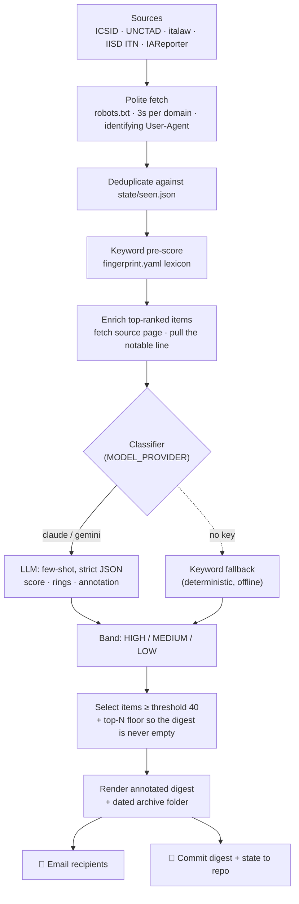

# ISDS Thematic Watcher

A zero-cost, automated weekly monitor for **investor–State dispute settlement (ISDS)**
developments at one specific doctrinal intersection — where intellectual property is
asserted as a protected investment, the disputed conduct is a regulatory or judicial
measure, and the case turns on jurisdiction and admissibility. Built as a research
instrument for the Benavides ISDS project; the full methods write-up lives in
**[METHODOLOGY.md](METHODOLOGY.md)**.

---

## 🔭 What it watches: three rings, one intersection

The theme was induced verbatim from three seed awards — *Philip Morris v. Australia*,
*Eli Lilly v. Canada*, and *Bridgestone v. Panama* — and operationalised as the overlap
of three doctrinal "rings":

1. **IP-as-investment** — patents, trademarks/licences, copyrights, GIs, data exclusivity, brand value as a covered investment.
2. **Regulatory or judicial measure as the disputed conduct** — public-interest legislation, a domestic court judgment, or judicial conduct itself *(weighted: a judicial-measure case scores at least MEDIUM on its own)*.
3. **Jurisdictional / admissibility doctrine** — abuse of right, treaty-shopping, foreseeability of the dispute, restructuring for treaty protection, the contested definition of "investor."

**Scoring.** HIGH (≥70) = two rings intersect · MEDIUM (40–69) = one strong ring + a weaker tie, or a judicial-measure case alone · LOW (<40) = one weak ring or none.

---

## 🏗️ How it works



Each stage is defensive: a failing source or item is logged and skipped, never fatal.
With no network the sources return empty; with no API key the classifier uses its
deterministic keyword fallback — so a dry run works fully offline.

---

## 📚 Read the digests

➡️ **[Browse the digest archive](digests/)** — every run, newest first, each with one
annotated entry per development and a direct link to the original source.

## 📨 What you receive

Every Monday, an **annotated-bibliography digest** to the configured recipients: each
surfaced development as a citation line, a two-sentence descriptive-and-evaluative
annotation, a quoted notable line drawn from the source, and the rings it matched. The
same content is committed to the repo under a dated archive folder
(`digests/YYYY-MM-DD_ISDS-Thematic-Watch/`) with one Markdown file per entry — browsable
and citable.

---

## ⚙️ Configuration

Runtime config comes from the environment (locally via `.env`; in CI via Secrets/Variables):

| Name | Where | Purpose |
|------|-------|---------|
| `MODEL_PROVIDER` | Actions **variable** | `claude` (default here) or `gemini` |
| `ANTHROPIC_API_KEY` / `GEMINI_API_KEY` | Secret | classifier key (match the provider) |
| `SMTP_HOST` · `SMTP_PORT` | Secret | `smtp.gmail.com` · `465` |
| `SMTP_USER` · `SMTP_PASS` | Secret | Gmail address + 16-char App Password |

Recipients are set in `src/config.py`. Optional model overrides: `GEMINI_MODEL`
(default `gemini-2.0-flash`), `ANTHROPIC_MODEL` (default `claude-haiku-4-5-20251001`).

---

## 🚀 Run it

```bash
python3.12 -m venv .venv && source .venv/bin/activate
pip install -r requirements.txt

# Fully offline (no key, no email) — deterministic keyword classifier:
python -m src.main --dry-run --since 7d --no-email

# Live (LLM + email); needs a .env — see .env.example:
python -m src.main --since 7d
pytest tests/                 # 15 tests, no network required
```

`--since` accepts `7d`, `14d`, `48h`, `1w`. The weekly workflow also takes a manual
`since` input for wider one-off windows.

---

## 💰 Cost

Public repo → unlimited GitHub Actions minutes. Claude Haiku ≈ $1/month (or Gemini Flash
free tier). No paid data sources — open feeds and pages only.

---

## 📐 Methodology & operations

- **[METHODOLOGY.md](METHODOLOGY.md)** — the full research-memo write-up: theoretical
  frame, source architecture, classification cascade, calibration, validation, and the
  methodological + doctrinal authorities behind each choice.
- **[HANDOFF.md](HANDOFF.md)** — secrets, triggering, troubleshooting, tuning.
- **[PLAN.md](PLAN.md)** — the per-ring verbatim vocabulary extracted from the seed awards.

---

## 📁 Repository layout

```
src/            sources/ (RSS+HTML, defensive), classify.py, enrich.py,
                render.py, email_send.py, state.py, main.py, config.py
prompts/        classifier.txt (few-shot LLM prompt)
templates/      digest.html.j2 (annotated-bibliography email)
fingerprint.yaml   the three-ring lexicon (weights sum to 100 per ring)
digests/        dated archive folders, committed each run
tests/          pytest suite
```

> **Note.** Google News RSS is currently `robots.txt`-disallowed and therefore inactive
> (honored, not evaded). IAReporter is read at headline level only — never the paywalled
> body.
